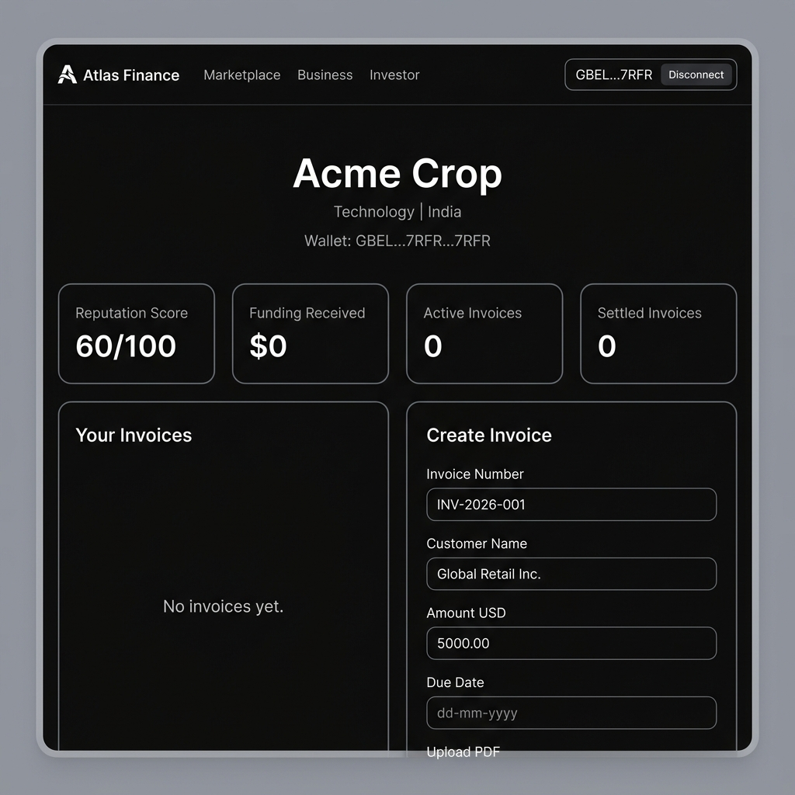
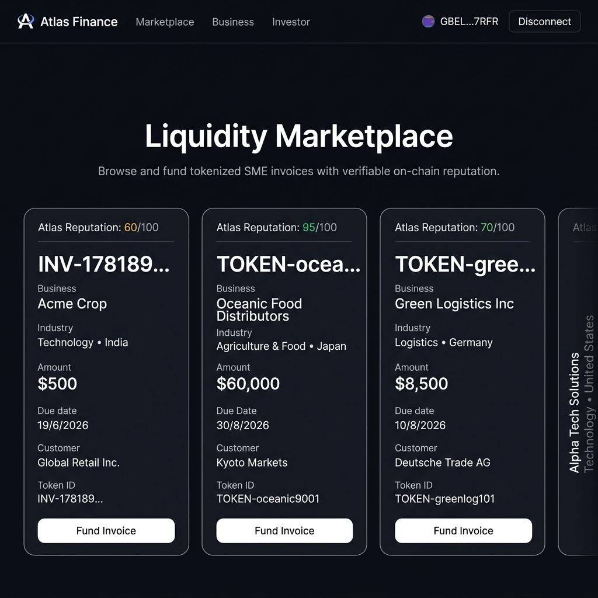
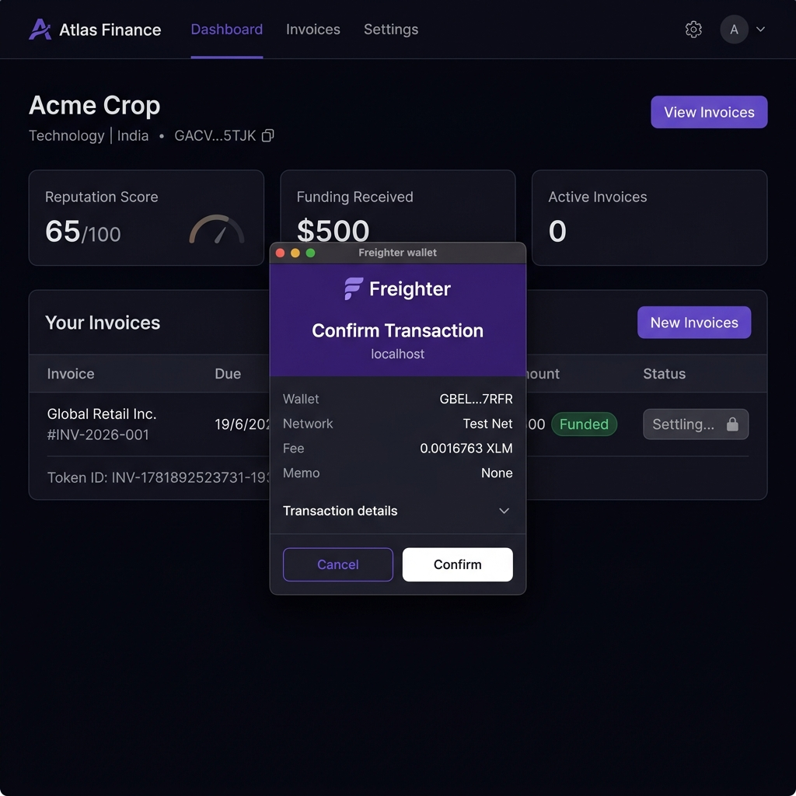
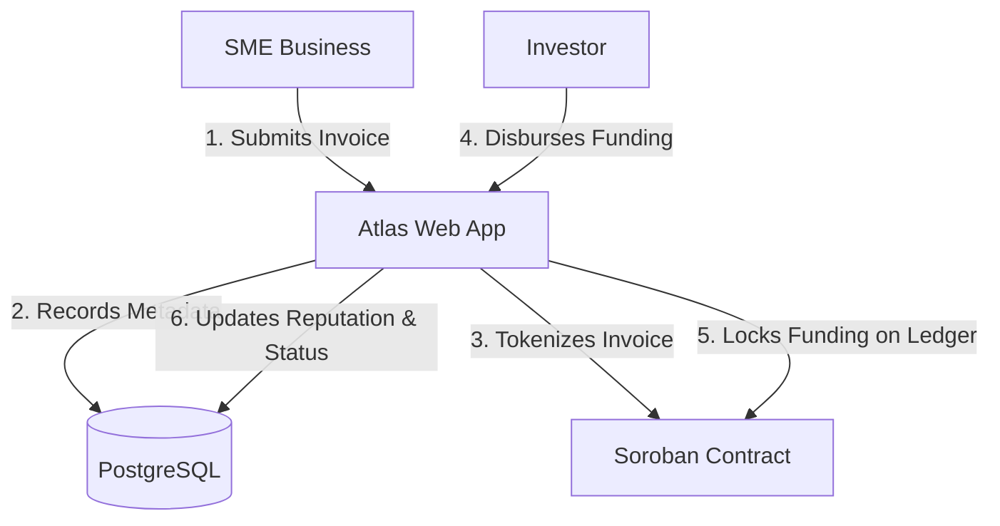

# Atlas Finance Network

Atlas Finance Network is a Stellar-powered credit reputation and invoice financing platform that enables SMEs to tokenize receivables, build verifiable financial reputation, and access liquidity through a decentralized marketplace.

Built for the Stellar Startup Track.

## Screenshots

### Business Dashboard



### Marketplace



### Freighter Transaction Signing



---

## Startup Track Deliverables

- `[x]` **Real Freighter Authentication**: Pure wallet-based session sync.
- `[x]` **Real Soroban Smart Contract**: On-chain invoice logic written in Rust.
- `[x]` **Stellar Testnet Deployment**: Fully deployed contract.
- `[x]` **Invoice Tokenization**: SME receivables minted as on-chain records.
- `[x]` **Liquidity Marketplace**: Decentralized marketplace for funding invoices.
- `[x]` **Reputation Engine**: Score updates synced on database matching ledger states.
- `[x]` **Settlement Automation**: Direct repayments updating ledger and DB.
- `[x]` **Seed Data**: Fully featured local seed script (`npm run seed`).
- `[x]` **Documentation**: Architecture and technical breakdown files.

## Deployed Smart Contract Details

- **Network**: Stellar Testnet
- **Contract ID**: `CAAJI6YPEPBWILAIIWSPM2RFC2IMN4KZ4YHRZWQQJSRZWLTB4TYHZOX7`
- **Explorer**: [Stellar Expert Explorer Link](https://testnet.stellar.expert/explorer/public/contract/CAAJI6YPEPBWILAIIWSPM2RFC2IMN4KZ4YHRZWQQJSRZWLTB4TYHZOX7)

---

## Problem

Millions of SMEs struggle to access working capital despite having legitimate invoices and ongoing business activity. Traditional invoice financing is often slow, expensive, and dependent on centralized credit systems that exclude smaller businesses.

As a result, businesses frequently wait weeks or months to receive funds tied up in unpaid receivables, limiting growth and operational capacity.

## Solution

Atlas Finance Network leverages the Stellar ecosystem and Soroban smart contracts to tokenize invoices. By tying repayment behavior to a deterministic, on-chain reputation score, the platform builds trust between SMEs and investors without relying on traditional credit models.

## What is On-Chain vs. Off-Chain?

For the Startup Track judges and mentors, here is a clear breakdown of what resides on the ledger versus our local datastore:

### 🌐 On-Chain (Soroban Smart Contracts)

- **Invoice Lifecycle & State**: Tokenization record and the current active state (`Tokenized`, `Funded`, `Settled`).
- **Funding Commitments**: Cryptographic locking of investor funding commitments mapped to tokenized invoice IDs.
- **Settlements**: Cryptographically signed repayment state confirmations and authorization validations.

### 💾 Off-Chain (PostgreSQL Cache / Metadata)

- **Rich Business Profiles**: SME descriptions, industry categorization, and physical locations.
- **Metadata Caches**: Duplicate indexing of ledger states to provide immediate dashboard search and indexing speeds.
- **Audit Documentation**: File upload hashes (e.g., PDF ledger hashes) for off-chain storage validation.

## Architecture & Tech Stack

- **Frontend:** Next.js 15 (App Router), TypeScript, TailwindCSS, shadcn/ui
- **Backend:** Next.js Server Actions, PostgreSQL (via Prisma ORM)
- **Blockchain:** Stellar Network, Soroban Smart Contracts (Rust)
- **Authentication:** Real Freighter Wallet integration (via `@creit.tech/stellar-wallets-kit` on Stellar Testnet)

Please see [docs/architecture.md](atlas-finance-network/docs/architecture.md) for detailed diagrams.

### System Flow & Funding Diagram



---

## MVP Scope

### Implemented

- Freighter wallet authentication
- Soroban invoice tokenization
- Invoice funding marketplace
- Reputation scoring engine
- Funding workflows
- Settlement workflows
- Stellar Testnet deployment
- PostgreSQL persistence

### Not Yet Implemented

- Anchor integrations
- KYC/KYB workflows
- Real-world payment rails
- Institutional underwriting
- Mainnet deployment
- Cross-border settlement partners

These features are planned for future milestones.

## What You Can Test Today

The MVP currently supports the complete Atlas financing lifecycle on Stellar Testnet:

1. Connect a Freighter wallet.
2. Register a business profile.
3. Create and tokenize an invoice through a Soroban smart contract.
4. View tokenized invoices in the liquidity marketplace.
5. Fund invoices as an investor through Freighter-signed transactions.
6. Automatically update SME reputation scores after funding.
7. Settle funded invoices through wallet-authorized transactions.
8. Record all funding and settlement activity on Stellar Testnet.

This demonstrates the core Atlas thesis: transforming SME receivables into fundable on-chain financial assets while building portable reputation through verifiable repayment behavior.

---

## Installation & Local Development

### Prerequisites

- Node.js 18+
- Rust toolchain and Soroban CLI
- PostgreSQL (or SQLite for local MVP dev)

### Setup the Next.js Web App

```bash
cd atlas-finance-network/apps/web
npm install
npx prisma db push
npm run seed  # Populates 3 businesses, 10 invoices, funding, and reputation history
npm run dev
```

The application will run on `http://localhost:3000`.

### Smart Contract Development

```bash
cd atlas-finance-network/contracts/invoice_contract
cargo test
cargo build --target wasm32-unknown-unknown --release
```

## Smart Contract Deployment

To deploy the Soroban contract to Stellar Testnet:

1. Configure the network and generate a test identity:

   ```bash
   stellar network use testnet
   stellar keys generate --global test-admin
   ```

2. Deploy the optimized WASM build:

   ```bash
   stellar contract deploy \
     --wasm target/wasm32-unknown-unknown/release/invoice_contract.wasm \
     --source test-admin \
     --network testnet
   ```

### Deployed Contract Address (Stellar Testnet)

```text
CAAJI6YPEPBWILAIIWSPM2RFC2IMN4KZ4YHRZWQQJSRZWLTB4TYHZOX7
```

## Future Roadmap

See [docs/mvp-scope.md](atlas-finance-network/docs/mvp-scope.md) for detailed features and future milestones, including AMM integration and IPFS decentralized storage.
