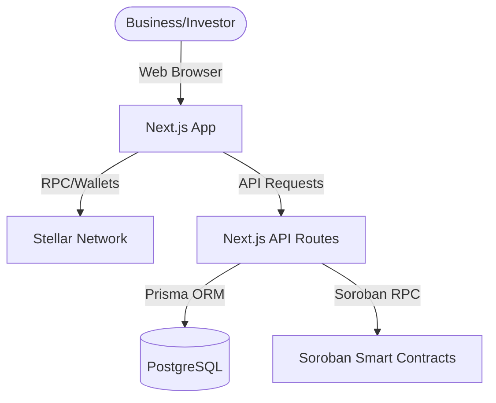
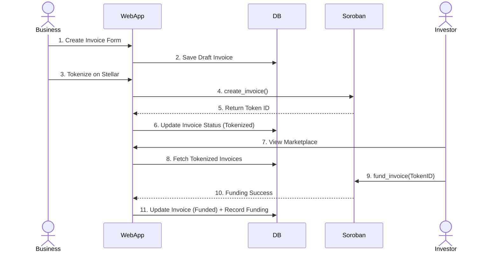

# Atlas Finance Network Architecture

## System Architecture

Atlas Finance Network is a full-stack decentralized application built on Stellar and Soroban. The MVP leverages Next.js for the frontend and API routes, PostgreSQL (via Prisma) for relational data and caching, and Soroban smart contracts for core business logic (invoice tokenization and settlement).

## Data Flow: Invoice Creation & Financing

## Contract Architecture

The `invoice_contract` handles state transitions on the Soroban network.
State Enum: `Draft` -> `Tokenized` -> `Funded` -> `Settled`

Functions:
- `create_invoice(id, owner, amount)`: Initializes a tokenized invoice.
- `fund_invoice(id, funder)`: Transitions invoice to `Funded`, recording the funder.
- `settle_invoice(id)`: Transitions invoice to `Settled`, authorized by the owner.
- `get_invoice(id)`: Returns the current state.

## Database Schema

- **User**: Maps Stellar Wallet ID to platform roles.
- **Business**: Business profiles linked to Users. Includes Reputation Score.
- **Invoice**: Off-chain metadata (PDF hash, Customer Name, Due Date) mapped to Soroban Token ID.
- **Funding**: Records Investor commitments to specific invoices.
- **Settlement**: Records successful payment resolutions.
- **ReputationHistory**: Append-only log of score changes (e.g., +10 for completion).
